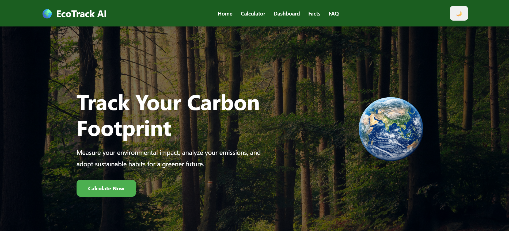
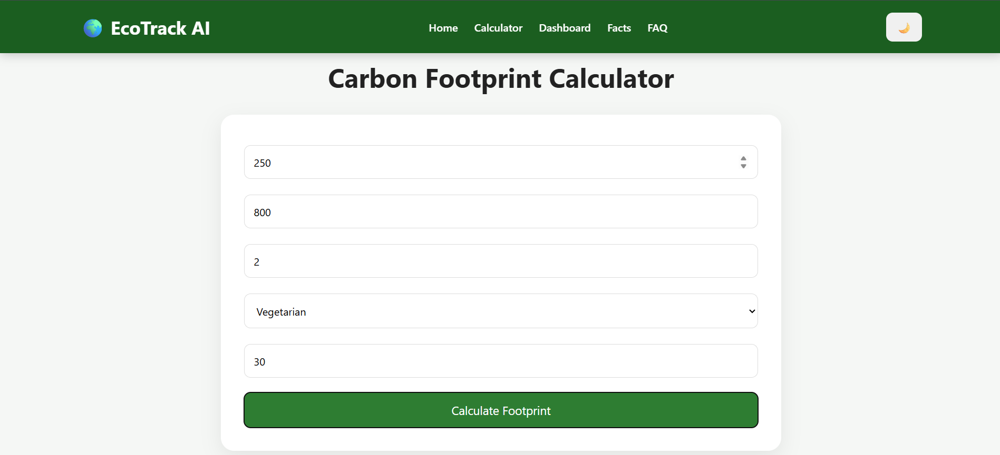
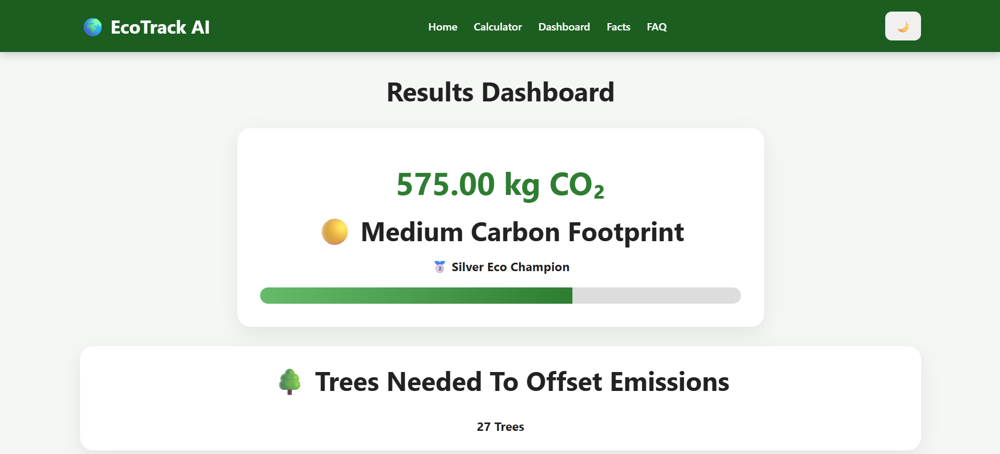
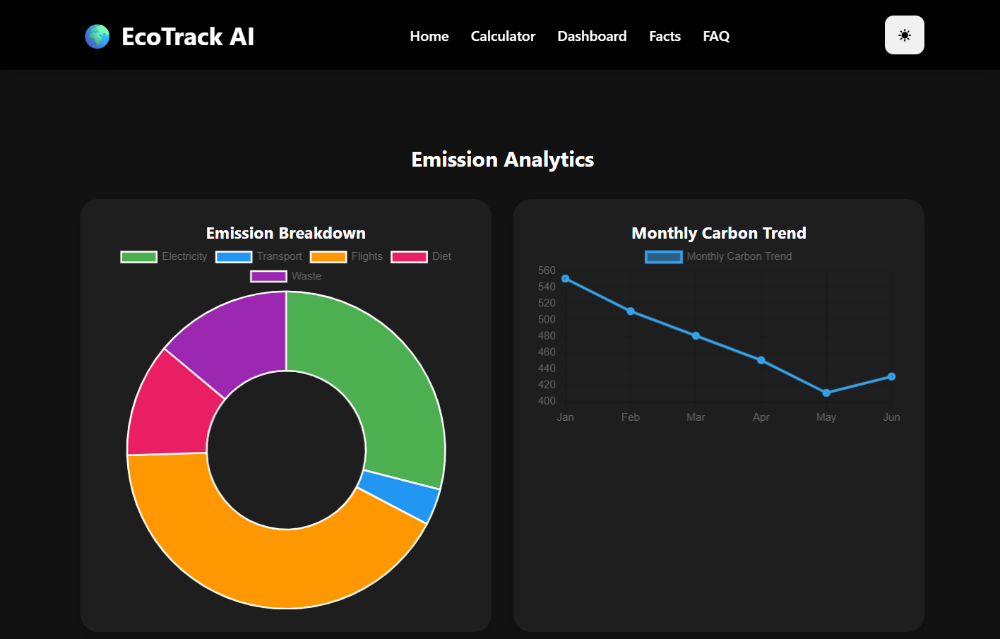

# 🌍 EcoTrack AI - Carbon Footprint Awareness Platform

## Overview

EcoTrack AI is a modern web application designed to help users calculate, analyze, and reduce their carbon footprint.

The platform provides an interactive carbon footprint calculator, emission analytics dashboard, AI-powered sustainability suggestions, and environmental awareness resources.

---

## ✨ Features

### 🌱 Carbon Footprint Calculator
Calculate emissions based on:

- Electricity Consumption
- Vehicle Travel Distance
- Flights Per Year
- Diet Type
- Waste Generation

### 📊 Emission Analytics Dashboard

- Carbon Score Analysis
- Emission Breakdown Chart
- Monthly Carbon Trend Graph
- Progress Indicator

### 🏆 Eco Badge System

Users receive badges based on their carbon footprint:

- 🥇 Gold Earth Saver
- 🥈 Silver Eco Champion
- 🥉 Bronze Eco Citizen

### 🌳 Tree Offset Calculator

Shows the estimated number of trees required to offset carbon emissions.

### 🤖 AI Eco Suggestions

Provides personalized recommendations to reduce environmental impact.

### 🌱 Green Challenge

Encourages users to:

- Plant Trees
- Save Electricity
- Use Public Transport
- Reduce Plastic Waste

### 🌍 Climate Awareness

Includes:

- Climate Facts
- Renewable Energy Awareness
- Frequently Asked Questions

### 🌙 Dark Mode

Modern dark/light theme support.

### 📄 Carbon Report Download

Users can download their carbon footprint report.

---

## 🛠 Technologies Used

- HTML5
- CSS3
- JavaScript
- Chart.js
- AOS (Animate On Scroll)

---

## 🌐 Live Demo

🔗 Website: https://ecotrack-ai.netlify.app/

Explore the live Carbon Footprint Awareness Platform here:

https://ecotrack-ai.netlify.app/

---

## 📂 GitHub Repository

GitHub Repository Link:

https://github.com/shivam-raj-0/EcoTrack-AI-Carbon-Footprint-Awareness-Platform

---

## 📂 Project Structure

```text
EcoTrack-AI/
│
├── index.html
├── style.css
├── script.js
├── README.md
└── assets/
    └── earth.png
```

---

## 🚀 How to Run

1. Download or clone the repository.
2. Open the project folder.
3. Run `index.html` in your browser.

No backend setup is required.

---

## 🔮 Future Enhancements

- User Authentication
- Real-time Climate Data API
- Carbon Footprint History Tracking
- AI Chat Assistant
- Gamification and Rewards System

---

## 👨‍💻 Author

**Shivam Singh**

B.Tech CSE (AI & ML)

---

## 🎯 Chosen Vertical

Environmental Sustainability & Climate Awareness

EcoTrack AI acts as a smart sustainability assistant that helps users understand, analyze, and reduce their carbon footprint through interactive calculations, emission analytics, and personalized recommendations.

---

## 🧠 Approach & Logic

The application collects user lifestyle information such as:

- Electricity Usage
- Vehicle Travel
- Flights Per Year
- Diet Preferences
- Waste Generation

Using predefined emission factors, EcoTrack AI calculates estimated carbon emissions and:

- Generates a Carbon Score
- Assigns an Eco Badge
- Estimates Required Tree Offsets
- Displays Interactive Charts
- Provides Personalized Sustainability Suggestions

The system follows a rule-based decision-making approach to simulate assistant-like behavior and guide users toward environmentally responsible choices.

---

## 📌 Assumptions Made

- Emission factors are approximate values used for awareness purposes.
- User inputs represent average monthly usage.
- Carbon calculations are simplified for educational use.
- Suggestions are generated using predefined sustainability rules.
- The platform is intended for awareness and learning purposes rather than official carbon auditing.

---

## 🎯 Project Purpose

This project was developed as part of the **Carbon Footprint Awareness Platform Challenge** to promote sustainability, climate awareness, and responsible environmental practices.

---

## 📸 Screenshots

### 🏠 Home Page



### 🧮 Carbon Calculator



### 📊 Dashboard



### 🌙 Dark Mode



---

## ⭐ Support

If you like this project, give it a ⭐ on GitHub.
